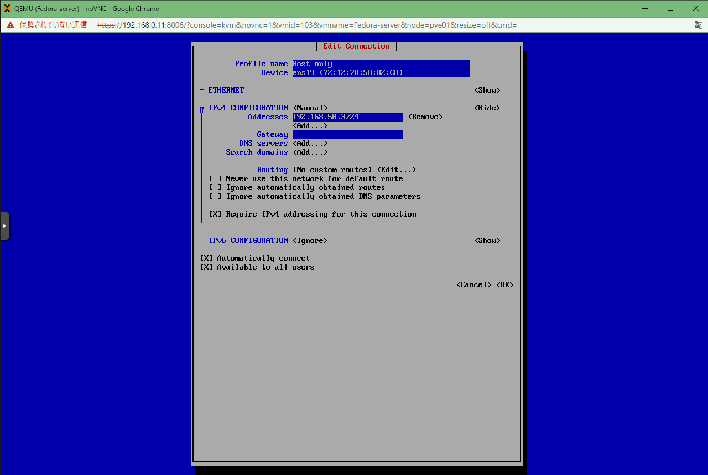

# 仮想サーバの構築 (1)
ここでは、以下のような仮想サーバを Proxmox 上に構築する

```
----+---------------------------+----------- 192.168.0.0/24 (Bridge)
    |                           |
ParrotOS (Attacker)         Ubuntu (Logging)
    |                           |
----+---+-------------------+---+----------- 192.168.50.0/24 (Host only)
        |                   |
    Fedora (Client)     Fedora (Server) 
```

## ネットワーク
- `192.168.0.0/24`
  - ホームネットワークと同一セグメント
  - ホームネットワークから仮想サーバにSSHで接続可能
- `192.168.50.0/24`
  - 外部と接続しない
  - DHCPサーバはない

## 仮想サーバの設定
### ParrotOS
#### 初期設定
[ParrotSec](https://www.parrotsec.org/) から ISO イメージをダウンロードして設定する。

ここでは以下のように設定した。

- CPU
  - 6 CPUs
- Memory
  - 8 GB
- Storage
  - 96 GB

```
sudo apt update
sudo apt -y upgrade
```

`realtek-rtl8188-dkms` でエラーが出る (参考：[[SOLVED] Update about parrot-upgrade (realtek-rtl8188-dkms error)](https://community.parrotsec.org/t/solved-update-about-parrot-upgrade-realtek-rtl8188-dkms-error/22489/27)) ので、解決する。

```
sudo apt purge realtek-rtl8188eus-dkms
sudo parrot-upgrade
sudo apt autoremove
sudo parrot-upgrade
```

#### SSH接続
```
sudo apt install ssh
sudo systemctl start ssh
sudo systemctl enable ssh
```

ホームネットワーク上のデスクトップPCからSSH接続できることを確認する。

#### 必要なパッケージのインストール
```
sudo apt install build-essential python-dev python3-dev libnetfilter-queue-dev
```

#### Python の環境構築
`venv` を使う

```
sudo apt install python3-venv
mkdir .venvs
python3 -m venv ~/.venvs/mitm
source ~/.venvs/mitm/bin/activate
(mitm) pip install --upgrade pip
(mitm) pip install scapy NetfilterQueue
(mitm) pip freeze
```

テスト
```
(mitm) python
>>> import scapy
>>> from netfilterqueue import NetfilterQueue
(Ctrl + D)
(mitm) deactivate
```

#### アップデートの自動化
スケジューラを用いる。

```
sudo nano /etc/crontab
```

以下を追記する。

```
00 3    * * *   root    apt update && apt -y upgrade && apt -y autoremove
```

### Ubuntu
#### 初期設定
[Ubuntu](https://releases.ubuntu.com/22.04/) から ISO イメージをダウンロードして設定する。

ここでは以下のように設定した。
- CPU
  - 4 CPUs
- Memory
  - 8 GB
- Storage
  - 256 GB

```
sudo apt update
sudo apt -y upgrade
```

#### SSH の設定
```
sudo apt install -y ssh
sudo systemctl start ssh
sudo systemctl enable ssh
```

#### CUI 運用にする
```
sudo systemctl set-default multi-user.target
```

### Fedora (Client, Server)
#### 初期設定
[Fedora](https://getfedora.org/ja/) から Server の ISO イメージをダウンロードして設定する。

ここでは以下のように設定した。

- CPU
  - 2 CPUs
- Memory
  - 2 GB
- Storage
  - 32 GB
- 最初は 192.168.0.0/24 のみ接続する。
- root ユーザを作る

```
yum update
```

`nmtui` をインストールする

```
yum install NetworkManager-tui
```

Host Only Network を追加して、`nmtui` で IP を固定 (下図は server の例)。



#### 運用方針
- 通常時は 192.168.0.0/24 のネットワークの接続を切る (nmtui で deactivate する)。
- 定期的に (1ヶ月に1回とか) アップデートのために nmtui で activate する。
