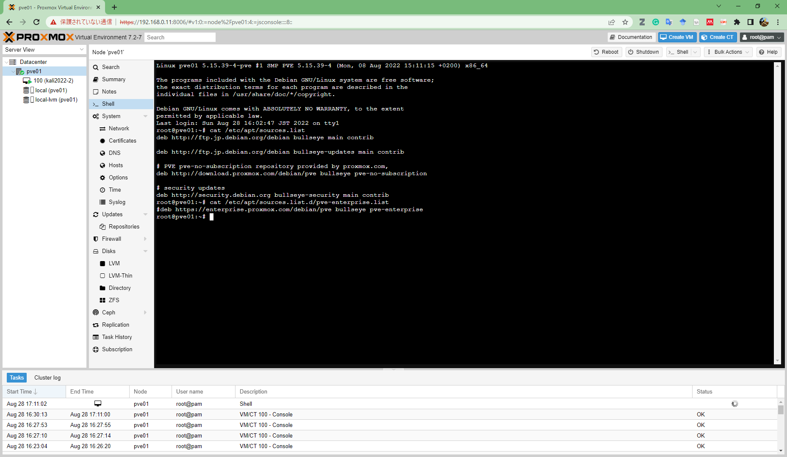

# サーバーを組む

- 作成日：2022/8/27

## サーバー
### 用途
- 24時間稼働で、仮想サーバーを動かし続ける
  - グラフィック機能はそれほど必要ない

### 構成
- CPU
  - [AMD Ryzen7 5700G](https://www.amd.com/ja/products/apu/amd-ryzen-7-5700g)：40,728円
- マザボ
  - [MSI MAG B550 TOMAHAWK](https://jp.msi.com/Motherboard/MAG-B550-TOMAHAWK)：19,618円
- SSD
  - [KIOXIA EXCERIA PLUS G2 (2,000GB)](https://personal.kioxia.com/ja-jp/ssd/exceria-plus-g2-nvme-ssd.html)：19,072円
- メモリ
  - [Crucial 64GB Kit (2 x 32GB) DDR4-3200 UDIMM](https://www.crucial.jp/memory/ddr4/ct2k32g4dfd832a)：25,273円
- 電源
  - [Hydro GSM Lite PRO 550W HGS-550M](https://www.fsplifestyle.com/jp/product/HydroGSMLitePRO550W.html)：8,619円
- ケース
  - [NZXT H510 Flow](https://www.ask-corp.jp/products/nzxt/middle-pccase/h510-flow.html)：9,819円

#### その他
- グリス：800円
- 起動診断サービス：2,500円

### 写真

## 自作する

## Proxmox の導入

インストールを進めていく。

参考：https://www.youtube.com/watch?v=i-ZGKBSVpeg

インストール後、リポジトリの設定を行った。

