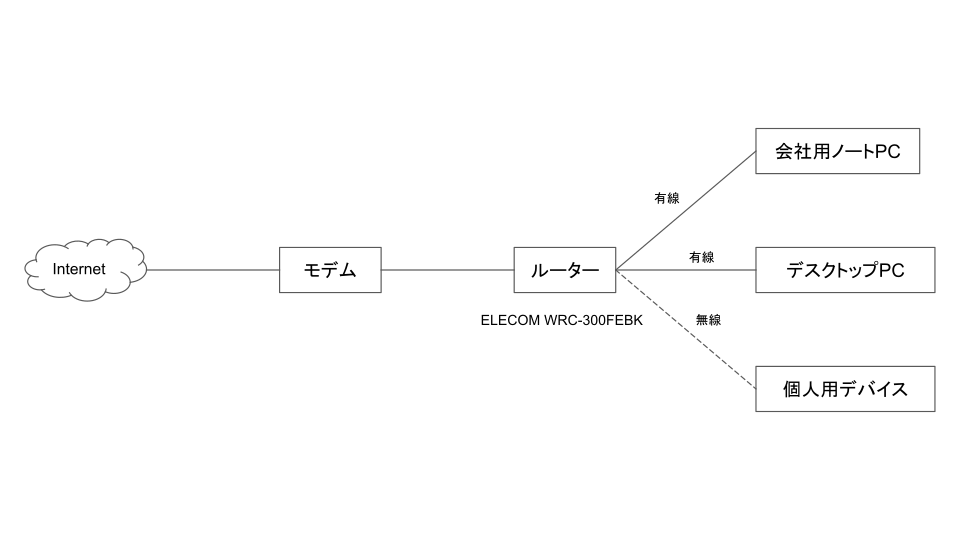
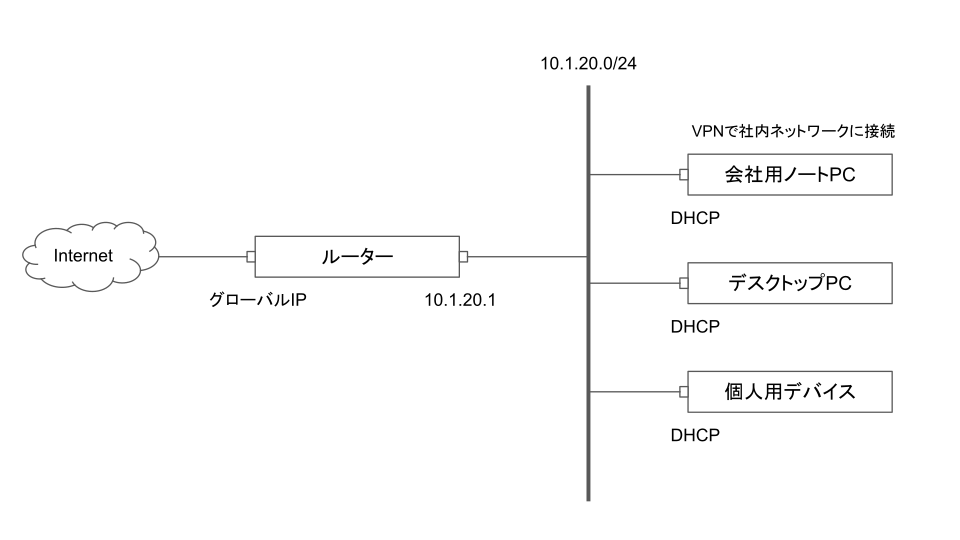
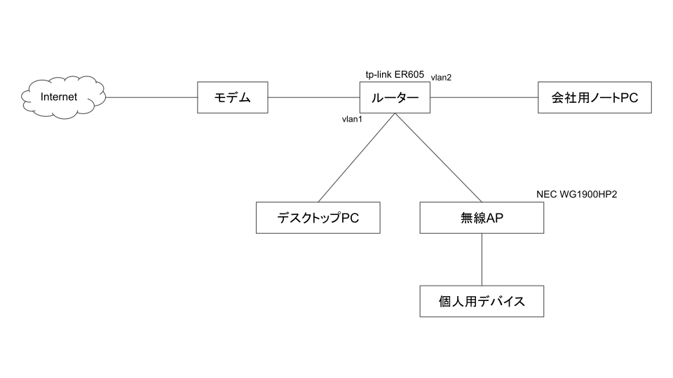
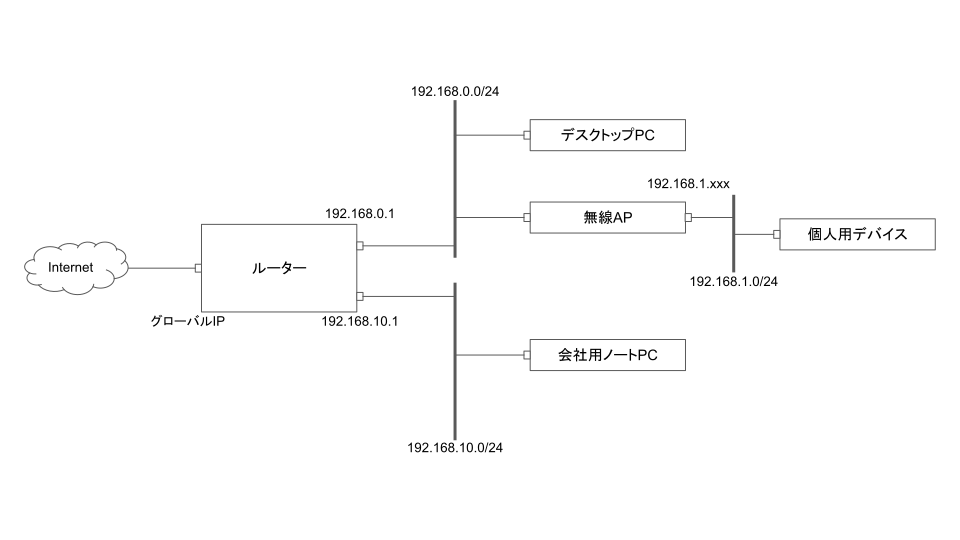

# 自宅インフラを構築した   (1) ネットワークまわりの改造

<!--
_class: lead
_pagenate: false
_header: ""
-->

## 目次
- きっかけと要件
- 初期環境と問題点
- ネットワークまわりの改造

## きっかけ
何故自宅インフラを構築しようと思ったのか？

- ホスト型の仮想環境を使って色々遊んでいたが、PCのスペック (メモリ、SSD) が足りず不便だった
- ネットワークとかサーバまわりをもっと知りたい
- 家のネットワークを整えたい 
- (サブスクは使いたくない。。。)

$\Rightarrow$ 家のインフラを整えれば解決じゃない？？？

---

### 要件
とりあえず、次のようなインフラを目指すことにする。

- **容易に拡張できる**
    - 機器を増やすときにあまり面倒じゃない方がうれしい
$\Rightarrow$ 最初にネットワークの大枠を決めてしまう

- **物理機器は最小限**
    - 引っ越しの手間を考えると物理機器は少なければ少ないほど良い
$\Rightarrow$ 仮想サーバーを使う

## 初期環境
よくある自宅ネットワークの構成 (つまらない)

---

---

#### 写真

 

---

#### スペックとか
- 無線LANルーター
    - [ELECOM WRC-300FEBK](https://www.elecom.co.jp/products/WRC-300FEBK.html)
        - 販売終了してる古いやつ。高校生の頃に買った。
- デスクトップPC
    - M1で買った Lenovo のデスクトップを魔改造しながら使ってる
        - core i5 9th Gen, Mem 16GB
        - SSD2枚刺しでデュアルブートしてる
        - 安いグラボを積んだ
        - USB 3.0 のインターフェースカードを入れた 

---

#### 遊び方
- Windows にゲームを入れて遊ぶ
    - 飽きっぽいからすぐ飽きる
- Kali Linux に KVM で仮想マシンを立てて遊ぶ
    - 途中でスペックが足りないことに気付く
    - 攻撃するマシンがホストOSだと色々不便

---

#### 問題点
- PCまわり
    - 環境を作って遊ぶにはPCのスペックが足りない
    - そもそもホスト型にするメリットがあまりない
- ネットワークまわり
    - 使っている無線LANルーターが販売中止しているし変えたい
    - よくある自宅ネットワーク構成はつまらない
    - ネットワークまわりの勉強と改造をしたい

$\Rightarrow$ **サーバー構築** & **ネットワークまわりの改造**

## ネットワークまわりの改造
- 新しい (有線) ルーターを導入する
    - 1Gbps くらいほしい
    - VLAN まわりの操作が楽なのがいい

$\Rightarrow$ [tp-link ER605](https://www.tp-link.com/jp/business-networking/omada-sdn-router/er605/)：Amazon 9,283円 (2022/8/21 購入)

- 無線APを新しくする
    - 安定していて、管理者まわりの操作が容易なのがほしい

$\Rightarrow$ [NEC Aterm WG1900HP2](https://www.aterm.jp/product/atermstation/product/warpstar/wg1900hp2/)：Amazon 7,399円 (2022/8/22 購入)

---

### 構成 (ver 1.0)

---

---

#### 写真

 

---

#### 個人的こだわりポイント
- 仕事用と個人用のネットワークのセグメントを分けた
  - やらかしても会社端末への影響を最小限に抑えるため (VPN使ってるけどね)
- 個人用の中でも有線と無線のセグメントを分けた
  - リスク源の切り分け

## 今後の予定
- 12月くらいまで
  - VLAN1 にスイッチングハブを導入
  - サーバー自作・Proxmox 導入
- 1月くらい
  - NAS 導入
  - 仮想サーバーを立てて色々遊ぶ
    - クライアント・サーバ
    - 監視・ログ取得

## 補足
サーバの構成を TSUKUMO さん (秋葉原) で相談しました。

- CPU
  - [AMD Ryzen 5 5600G](https://www.amd.com/ja/products/apu/amd-ryzen-5-5600g)：22,979円～
  - [AMD Ryzen 7 5700G](https://www.amd.com/ja/products/apu/amd-ryzen-7-5700g)：31,053円～
- マザボ
  - [ASRock X570 Steel Legend](https://www.asrock.com/mb/AMD/X570%20Steel%20Legend/index.jp.asp)：24,651円～
- ケース
  - [H7 Flow Black](https://www.aiuto-jp.co.jp/products/product_4044.php)：19,300円～

---

- 電源
  - [Hydro GSM Lite PRO 550W HGS-550M](https://www.fsplifestyle.com/jp/product/HydroGSMLitePRO550W.html)：8,300円～
- SSD
  - [WD Blue SN570 NVMe SSD (2TB)](https://www.westerndigital.com/ja-jp/products/internal-drives/wd-blue-sn570-nvme-ssd#WDS250G3B0C)：22,800円～
- メモリ
  - [Crucial 64GB Kit (2 x 32GB) DDR4-3200 UDIMM](https://www.crucial.jp/memory/ddr4/ct2k32g4dfd832a)：25,980円～

$\Rightarrow$ 15万円くらい