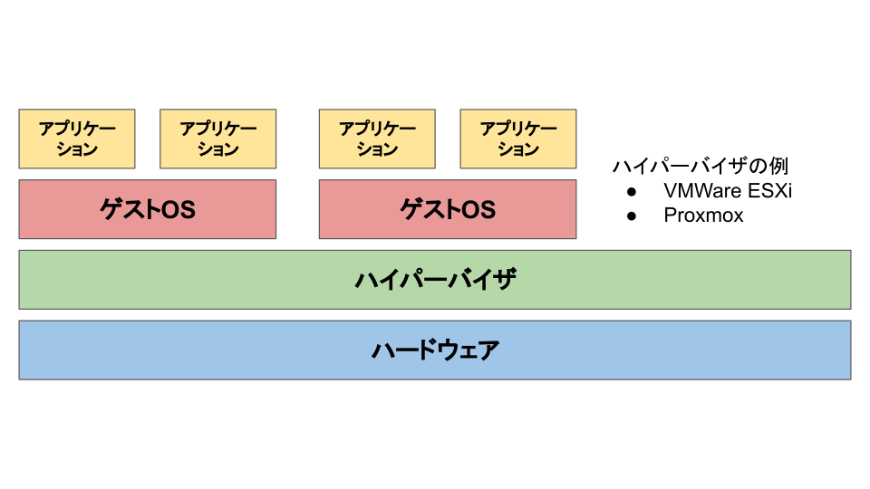
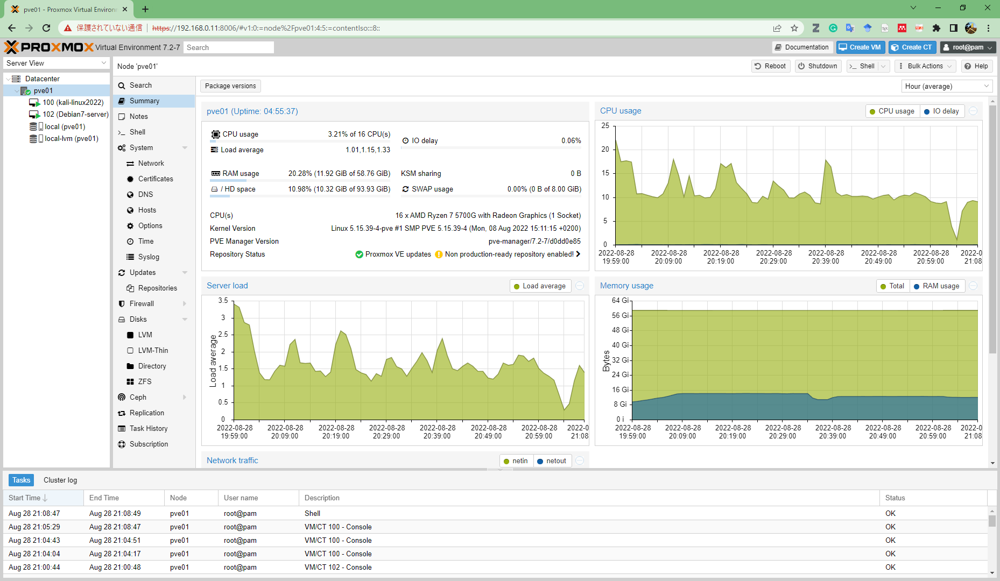
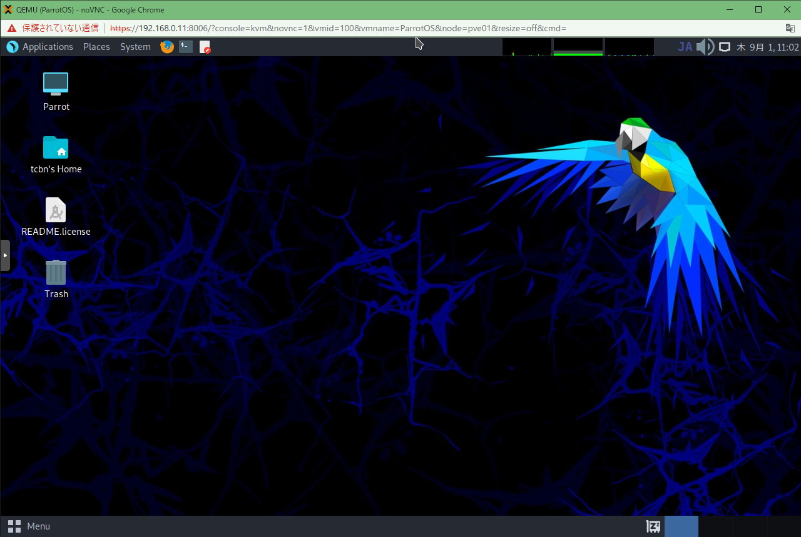

<style>
img[alt~="center"] {
  display: block;
  margin: 0 auto;
}
</style>

# 自宅インフラを構築した <br> (2) サーバーを自作して仮想化する

<!--
_class: lead
_pagenate: false
_header: ""
-->

## 目次
- 何故今時自作サーバー？？？
- パーツを選んで買う
- サーバーを組む
- Proxmox の導入
- まとめ

## 何故今時自作サーバー？？？
- 環境構築とかネットワークまわりの勉強をしたい
  - 自分で作れば多少勉強できる気がした
- 自分で使うための用途にサブスクのクラウドは使いたくない
  - どれくらい使うかわからないし、課金はしたくない
- 自分で好きなだけ使える
  - いくら使ってもいいし、いくら壊してもいい (なお電気代)
- ロマン
  - 『家にサーバーあります』ってかっこいいよね

## パーツを選んで買う
今回は、以下の用途のサーバーを組みたいと思う。

- 24時間稼働し、サーバー上で仮想サーバーが何台も動く
  - グラフィック機能は必要ない
  - CPU、メモリ、SSDは結構必要

$\Rightarrow$ この目的にあったサーバーを組むために、PCショップの[TSUKUMO](https://tenpo.tsukumo.co.jp/stores/view/honten)で店員さんに相談した。

---
### 構成
相談した結果はこんな感じ。

- CPU
  - [AMD Ryzen7 5700G](https://www.amd.com/ja/products/apu/amd-ryzen-7-5700g)：40,728円
- マザボ
  - [MSI MAG B550 TOMAHAWK](https://jp.msi.com/Motherboard/MAG-B550-TOMAHAWK)：19,618円
- SSD
  - [KIOXIA EXCERIA PLUS G2 (2,000GB)](https://personal.kioxia.com/ja-jp/ssd/exceria-plus-g2-nvme-ssd.html)：19,072円

---

- メモリ
  - [Crucial 64GB Kit (2 x 32GB) DDR4-3200 UDIMM](https://www.crucial.jp/memory/ddr4/ct2k32g4dfd832a)：25,273円
- 電源
  - [Hydro GSM Lite PRO 550W HGS-550M](https://www.fsplifestyle.com/jp/product/HydroGSMLitePRO550W.html)：8,619円
- ケース
  - [NZXT H510 Flow](https://www.ask-corp.jp/products/nzxt/middle-pccase/h510-flow.html)：9,819円
- (グリス：800円)
- (起動診断サービス：2,500円)

$\Rightarrow$ 約15万円。思ったより安いよね。

---

#### 写真

 

## サーバーを組む
 

---

組むのはかなり楽だった

- 起動診断を TSUKUMO さんにお願いしていた
  - マザボにCPU、SSD、メモリをつけたままにしてくれた
  - 事前に BIOS が起動するのを確認してくれた
- ケースが大きい
  - マザボや電源の取り付けが楽だった

## Proxmox の導入
ハイパーバイザ型の仮想マシンとして動かすことにする。



---


---

#### Proxmox の特徴
- Webの管理画面で仮想サーバーの管理ができる
- 無料で使える (VMWare ESXiは有償になってしまった)
- SSHでサーバーに入ることができる
- 複数ノードのクラスタもできる
  - サーバーを冗長構成にできる (今回はやってない)
- 仮想サーバーのスナップショット機能がある

---



---
#### 注意点
- サブスクリプションなしでも使えるリポジトリを追加すること
  - [Proxmox VE7.0をインストールしクラスタを構築する](https://qiita.com/yuuri23/items/7d3bc77b441728f8621b)

```
(/etc/apt/sources.list に以下を追加)
deb http://download.proxmox.com/debian/pve bullseye pve-no-subscription
```

```
(/etc/apt/sources.list.d/pve-enterprise.list をコメントアウト)
#deb https://enterprise.proxmox.com/debian/pve bullseye pve-enterprise
```

---
### 仮想サーバーの構築
1. ISO イメージのダウンロードまたはアップロード
2. Create VM から仮想サーバーを作成
   - 設定をいろいろ変更できる

#### 注意点
- 起動前に VM の Options の KVM hardware virtualization を "No" に変更する
  - "Yes" のままだと起動できない

---



## まとめ
- サーバーを自作しました。
  - 総額15万円でした。安い。
- Proxmox をインストールして、Webコンソールから仮想サーバーを作りました。
- 今後の予定
  - いろんな仮想サーバーを立てて遊ぶ
  - スイッチングハブを買う (LANポートが全部埋まってしまった)
  - NASを導入して Proxmox のストレージに使いたい

---

#### 立てる仮想サーバーの例
- tcp/udp プロトコルで通信をする client - server
  - Debian で、CUI 運用
- ログ取得のための仮想サーバー
  - 通信ログをとるとか